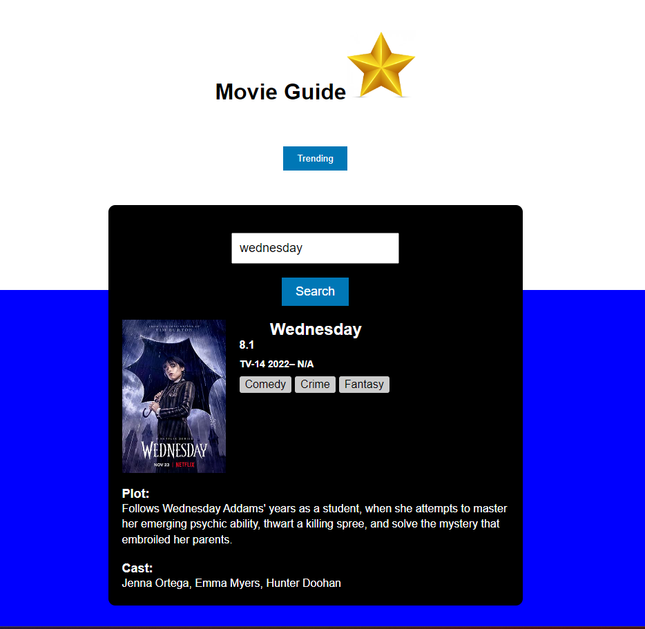

 # Movie-Database

## Description

The movie database was created to allow a movie search to view movies with their information and to view currently trending movies. The database features dynamically updated HTML and CSS while using the OMDB and Movies TV Shows Database API. 

## Usage

When the movie database is opened, there is a search bar to search movies and trending button to view currently trending movies.
Upon searching a movie, the movie information is presented.
The movie information will present the movie title, movie poster, imdb rating, the year it was created, runtime, genre, plot and actors from the OMDB API.
The trending moves are presented using Movies Tv Shows Database API with their release date.

## Screenshot
